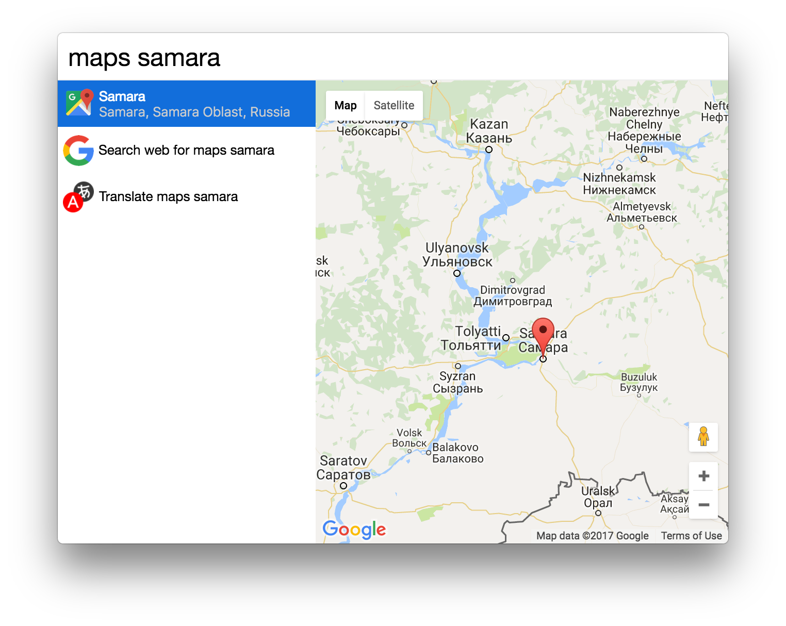

# cerebro-google-maps

> [Cerebro](http://www.cerebroapp.com) plugin quick search of location on google maps

## Usage

Just enter what you want to convert!

## Features
* Supports names of locations and addresses;
* Supports english and russian language (i.e. `карта москвы` or `new york on map`).

## Related

- [Cerebro](http://github.com/KELiON/cerebro) – main repo for Cerebro app;
- [cerebro-plugin](http://github.com/KELiON/cerebro-plugin) – boilerplate to create Cerebro plugins;

## License

MIT © [Alexandr Subbotin](http://asubbotin.ru)
